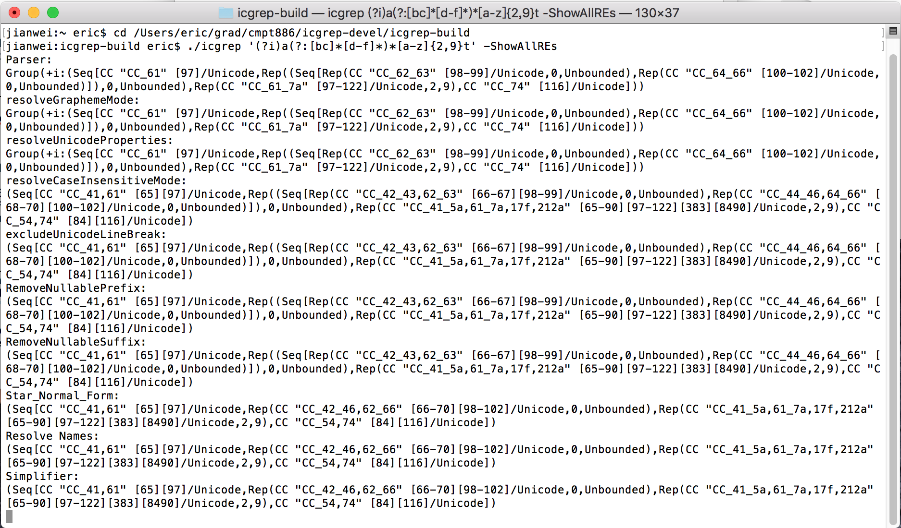

# Error Bit Stream

We know that **Parabix** uses the *basis bit streams* to construct *character-class bit streams* in which each 1 bit indicates the presence of a significant character (or class of characters) in the parsing process. The *advance* operation is mentioned in class:

```
 input data     <My> <name] <is> <> <jianwei>
     C0         1....1......1....1..1........   character-class bit stream of <
L0=advance(C0)  .1....1......1....1..1.......   character-class bit stream after advance
```
The bit after advance is called cursor bit.

### ScanThru operation
*ScanThru* is an operation in **Parabix** that sets the cursor position immediately after a run of marker position in the input bit stream. *ScanThru* accepts two input parameters, *c* and *m*, where *c* denotes an initial set of cursor positions, and *m* denotes a set of “marked” lexical item positions. The ScanThru operation determines the cursor positions immediately following any run of marker positions by calculating `(c+m)∧¬m`.

```
 input data     <My> <name] <is> err <jianwei> <>li>
     C0         1....1......1........1.........1....   character-class bit stream of <
L0=advance(C0)  .1....1......1........1.........1...   character-class bit stream after advance
    Alpha       .11...1111...11..111..1111111....11.   character-class bit stream of alphabet
   
   let's calculate L1=ScanThru(L0,Alpha)=(L0+Alpha)∧¬Alpha
   
                <My> <name] <is> err <jianwei> <>li> 
 T0=L0+Alpha    ...1......1....1.111.........1..111.
   ¬Alpha       1..111....111..11...11.......1111..1
 L1=T0∧¬Alpha   ...1......1....1.............1..1...
```

```
                <My> <name] <is> err <jianwei> <>li>
     C1         ...1...........1.............1..1..1      character-class bit stream of >
L0=advance(C0)  .1....1......1........1.........1...
   ¬Alpha       1..111....111..11...11.......1111..1
```

```
   E2=T0∧¬L1    .................111.............11.
 E0=L0∧¬Alpha   ................................1...
   E1=L1∧¬C1    ..........1.........................
```


```
 input data     <My> <name] <is> err <jianwei>
     C0         1....1......1........1........   character-class bit stream of <
L0=advance(C0)  .1....1......1........1.......   character-class bit stream after advance
    Alpha       .11...1111...11..111..1111111.   character-class bit stream of alphabet
   
   let's calculate L1=ScanThru(L0,Alpha)=(L0+Alpha)∧¬Alpha
   
                <My> <name] <is> err <jianwei>  
 T0=L0+Alpha    ...1......1....1.111.........1
   ¬Alpha       1..111....111..11...11.......1
 L1=T0∧¬Alpha   ...1......1....1.............1
```

```
                <My> <name] <is> err <jianwei> 
     C1         ...1...........1.............1      character-class bit stream of >
L0=advance(C0)  .1....1......1........1.......
   ¬Alpha       1..111....111..11...11.......1
   

   E0=T0∧¬L1    .................111..........
 E1=L0∧¬Alpha   ..............................
   E2=L1∧¬C1    ..........1...................
```


```
 input data     <My> <name] <is> err <>jianwei>
     C0         1....1......1........1.........   character-class bit stream of <
L0=advance(C0)  .1....1......1........1........   character-class bit stream after advance
    Alpha       .11...1111...11..111...1111111.   character-class bit stream of alphabet
   
   let's calculate L1=ScanThru(L0,Alpha)=(L0+Alpha)∧¬Alpha
   
                <My> <name] <is> err <>jianwei>  
 T0=L0+Alpha    ...1......1....1.111..11111111.
   ¬Alpha       1..111....111..11...111.......1
 L1=T0∧¬Alpha   ...1......1....1......1........
```

```
                <My> <name] <is> err <>jianwei> 
     C1         ...1...........1......1.......1      character-class bit stream of >
L0=advance(C0)  .1....1......1........1........
   ¬Alpha       1..111....111..11...111.......1
   
                ...1......1....1.111..11111111.
                111.111111.1111.111111.11111111
   E0=T0∧¬L1    .................111...11111111
 E1=L0∧¬Alpha   ......................1........
                ...1......1....1......1........
                111.11111111111.111111.1111111.
   E2=L1∧¬C1    ..........1....................
```


```
 input data     <My> <name] <is> err <> <jianwei>
     C0         1....1......1........1..1........   character-class bit stream of <
L0=advance(C0)  .1....1......1........1..1.......   character-class bit stream after advance
    Alpha       .11...1111...11..111.....1111111.   character-class bit stream of alphabet
   
   let's calculate L1=ScanThru(L0,Alpha)=(L0+Alpha)∧¬Alpha
   
                <My> <name] <is> err <> <jianwei>  
  L0+Alpha      ...1......1....1.111..1.........1
   ¬Alpha       1..111....111..11...11111.......1
     L1         ...1......1....1......1.........1
```

```
                <My> <name] <is> err <> <jianwei> 
     C1         ...1...........1......1.........1      character-class bit stream of >
L0=advance(C0)  .1....1......1........1..1.......
   ¬Alpha       1..111....111..11...11111.......1
  E1=L0∧¬Alpha  ......................1..........
```

You all can use the [editor on GitHub](https://github.com/lijianweizhuwei/jianweiCMPT886/edit/master/index.md) to maintain and preview the content for your website in Markdown files.

Whenever you commit to this repository, GitHub Pages will run [Jekyll](https://jekyllrb.com/) to rebuild the pages in your site, from the content in your Markdown files.

### Markdown

Markdown is a lightweight and easy-to-use syntax for styling your writing. It includes conventions for

```markdown
Syntax highlighted code block

# Header 1
## Header 2
### Header 3

- Bulleted
- List

1. Numbered
2. List

**Bold** and _Italic_ and `Code` text

[Link](url) and 
```

For more details see [GitHub Flavored Markdown](https://guides.github.com/features/mastering-markdown/).


### Jekyll Themes

Your Pages site will use the layout and styles from the Jekyll theme you have selected in your [repository settings](https://github.com/lijianweizhuwei/jianweiCMPT886/settings). The name of this theme is saved in the Jekyll `_config.yml` configuration file.

### Support or Contact

Having trouble with Pages? Check out our [documentation](https://help.github.com/categories/github-pages-basics/) or [contact support](https://github.com/contact) and we’ll help you sort it out.
