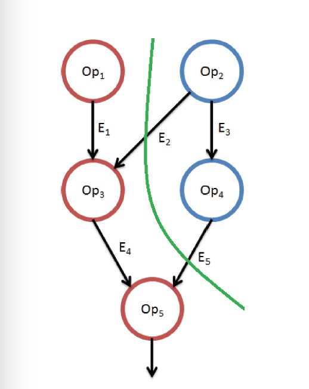

# SIMD Legalization and SWAR

## Project Introduction

Our project aims to handle arbitrary SIMD instruction set, we plan to introduce a new method for handling arbitrary vectors with a combination of type legalization technology and the SWAR technology.

As there're many partitioning available for the SIMD register, the operation of typical vectors such as i8, i16 are well supported. Efficient implementations rarely support the arbitrary vectors (oddballs), though they're allowed by the LLVM grammer.

Arbitrary SIMD instruction set contains arbitrary vectors, which will decrease the efficiency of vectorization. Some technologies are used to handle the arbitrary vectors, such as *type legalization technology* and *SWAR technology*, but somehow they are conflicting and have different performance in variable situations. 

To execute the arbitrary SIMD instruction set efficiently, we need to define a model to handle it with certain technology in an optimal sequence.

Our model will take the arbitrary SIMD instruction set as an input, and for each operation in this instrcution set, it will find the best method (the best method will be the best type legalization method or the best SWAR method), finally output the optimal method sequence and combination of the input arbitrary set.

Our work need to preserve the same workloads and improve the performance comparing to the traditional technologies (such as less registers needed or improve the execution time).

## What is SIMD type legalization?

In the LLVM infrastructure, type legalization is the process of transforming IR code to replace all illegal types and operations with legal ones.

Types are considered legal on an architecture if values of that type are *directly* supported by a register class on that architecture and if the instruction set provides *explicit support for operations on the type*. Vector types are considered legal on an architecture when:
* the total vector size in bits is equal to the size of SIMD registers on the architecture
* the scalar size of vector elements is supported by specific SIMD operations on that architecture.

### Illegal example
* Vector type `<3 x i8>` is considered illegal on practical architectures, because they have no 24-bit registers.
* Vector type `<3 x i6>` is considered illegal on practical architectures, because they have neither 18-bit registers, nor SIMD operations that support 6-bit field widths.

### Possible Methods of Legalization

* **Scalarization:** 
Which won't be considered in our project, because it will severely decrease the efficiency.

* **Splitting:**
If a vector is too big for architectural registers, *splitting* breaks up the vector into multiple shorter vectors that fit the architecture.

* **Vector Widening:**
Add unused vector elements to widen the vector to fit in a physical register. With this legalization method, the type of the vector elements does not change, only the number of elements.
 
   For example, a vector of < 4 × i8 > integers can be widened to a vector of < 6 × i8 > integers.

src="https://github.com/lijianweizhuwei/CMPT886/blob/master/image/VectorWidening.png"/></div>


* **Vector Element Promotion:**
In this method, the number of vector elements does not change, only the size of each element.

For example, a vector of `< 4 × i8>` integers can be promoted to a vector of `< 4 × i32 >` integers.

src="https://github.com/lijianweizhuwei/CMPT886/blob/master/image/VectorPromoting.png"/></div>
* **Combination of Vector Widening and Vector Element Promotion:**
For a special case like a vector of type `<6 x i3>`, it could be widen and promoted to `<8 x i4>` (if the i32 sized vector is efficiently supported) or a typical `<16 x i8>` (why not `<32 x i4>`? because it's not typically supported on most CPUs).

## What is SWAR?
SWAR, which means SIMD within a register, is a technique for performing parallel operations on data contained in a processor register. The basic concept of SWAR is that operations on word-length registers can be used to speed-up computations by performing SIMD parallel operations on `n x k/n` bit field values.

For example, `<32 x i4>` vectors are not typically supported on most CPUs, but the operations on these vectors can be simulated on `<16 x i8>` vectors.

As the example we used in `Combination of Vector Widening and Vector Element Promotion`, we can easily use SWAR to maintain a total of 18 bits for the size of the elements.

## Why our project want the combination of Legalization and SWAR?
### Example 1:

For a vector of type `<25 x i5>` and register size 128-bit, if we use a type legalization technology, we can promote and wide the vector to `<32 x i8>`, the split it into two vecters of type `<16 x i8>`. This type legalization approach need two registers. But somehow the vector `<25 x i5>` can fit in one 128-bit register, which can be achieved by SWAR.

### Example 2:

For a vector of type `<15 x i5>` and register size 128-bit, if we use a type legalization technology, we can promote and wide the vector to `<16 x i8>`, this approach needs only one register, which doesn't increase the number of register comparing to SWAR. As the SIMD vector type `<16 x i8>` is well supported by the LLVM/Parabix framework, we prefer to use the Type Legalization method.

### Conclusion
The above examples imply that in some situations, SWAR technology works better than a Type Legalization one, such as when the register resource is a limitation (example 1). In some other situations (example 2), Type Legalization is a better choice.

So the combination of type legalization and SWAR is needed, as well as a cost evaluation model.

## An introductory example showing the target of our project
### [Hybrid Type Legalization Model](https://dl.acm.org/citation.cfm?id=2509420.2509422)
We learned such a model to choose the best type of legalization. A type legalization decision is in essence a
graph coloring problem of a DAG. 

Each node in the DAG which represents an operation can be legalized in one of several ways; these are the colors of the graph. 

Each typed operation in the DAG has a different estimated cost for each legalization technique.



The cost of the DAG in this example is evaluated by accumulating the cost of the nodes and edges.

```
Node cost: Red[Op1]+ Red[Op3]+ Red[Op5] +Blue[Op2]+ Blue[Op4]
Edge cots: RedToBlue[E2] + RedToBlue[E5]
Total cost = Node cost + Edge cost

```

As we all know, this problem can be reduced to a 2-color problem which can be solved in polynomial-time. However, in our project, we tried to use several legalization methods which means the problem is NP-hard. We'll try to use approximation algorithm to get a near-optimal solution.

### The implementation of different operations by using SWAR
#### 1. [Types of Operations](http://www.phys.aoyama.ac.jp/~w3-furu/aoyama+/Tech_notes/adaptor_doc/Users_Guide.pdf)
* Polymorphic Operations (data type independent) e.g.: AND, OR, ...
* Partitioned Operations (not independent) e.g.: + - x /
* Communication & Type Conversion Operations
* Recurrence Operations (Reductions, Scans, etc.)
* Masking Operations

#### 2. [Ways of Tranformation](https://www.tldp.org/HOWTO/Parallel-Processing-HOWTO-4.html)
1. Partitioned Instructions (hardware support)
2. ***Unpartitioned Operations With Correction Code***
3. ***Controlling Field Values***
### 


