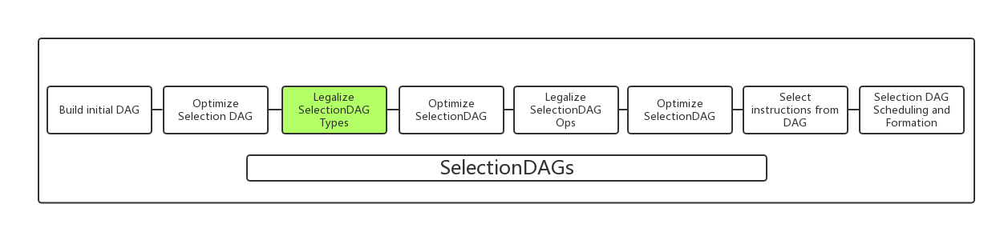

# SIMD Legalization and SWAR
<<<<<<< HEAD
## Alternative SIMD Legalization Approaches

### introduction

LLVM uses a SelectionDAG-based instruction selector, which translates the LLVM IR code to target machine instructions.

Our project focus on `SelectionDAG LegalizeTypes Phase`, which in charge of converting a DAG to only use the types that are natively supported by the target.

#### The ways of legalization
The type legalization phase transforms the program so that all of the calculations in the program operate on legal types, meaning that they can fit into a machine register. 

Typical legalization phase has three ways to legalize vector types: `Scalarization`, `Vector Widening` and `Vector Element Promotion`.

We use the notation `<N × T>` to describe `vector types`. The `N` variable denotes `the number of vector elements` and `T` denotes `the element type`. The element type iXX indicates an integer which is XX bits wide.

#### Scalarization
Split the incoming vector into multiple scalars.

#### Vector Widening
Add unused vector elements to widen the vector to fit in a physical register.

With this legalization method, the type of the vector elements does not change, only the number of elements. 

For example, a vector of < 4 × 8 > integers would be widened to a vector of < 6 × 8 > integers


#### Vector Element Promotion

=======

#### What is type legalization?

Types are considered legal on an architecture if values of that type are **directly** supported by a register class on that architecture and if the instruction set provides explicit support for operations on the type.
Vector types are considered legal on an architecture when:
* the total vector size in bits is equal to the size of SIMD registers on the architecture
* the scalar size of vector elements is supported by specific SIMD operations on that architecture.

**illegal example**
* vector type `<3 x i8>` is considered illegal on practical architectures, because they have no 24-bit registers.
* vector type `<3 x i6>` is considered illegal on practical architectures, because they have neither 18-bit registers, nor SIMD operations that support 6-bit field widths.
>>>>>>> 6a83c258b6245d1620ba4b10133e12959a0843b0


Suppose we have the regular expression `<[a-zA-Z]+>` and wish to find all instance which are not in this pattern and regard them as errors, then form the error bit stream. For example:

```
   input data      <My> <name] <is> err <jianwei> <>li>
error bit stream   ..........1......111............1...
```
There are three errors, `]`, `err` and `>`, the error bit stream we want it shown as above.

### How can we achieve it?
We know that **Parabix** uses the *basis bit streams* to construct *character-class bit streams* in which each 1 bit indicates the presence of a significant character (or class of characters) in the parsing process. The *advance* operation is mentioned in class:

```
 input data     <My> <name] <is> err <jianwei> <>li>
     C0         1....1......1........1.........1....   character-class bit stream of <
L0=advance(C0)  .1....1......1........1.........1...   character-class bit stream after advance
```
The bit after advance is called cursor bit.

### ScanThru operation
*ScanThru* is an operation in **Parabix** that sets the cursor position immediately after a run of marker position in the input bit stream. *ScanThru* accepts two input parameters, *c* and *m*, where *c* denotes an initial set of cursor positions, and *m* denotes a set of “marked” lexical item positions. The ScanThru operation determines the cursor positions immediately following any run of marker positions by calculating `ScanThru(c,m)=(c+m)∧¬m`.

```
 input data     <My> <name] <is> err <jianwei> <>li>
     C0         1....1......1........1.........1....   character-class bit stream of <
     C1         ...1...........1.............1..1..1   character-class bit stream of >
    Alpha       .11...1111...11..111..1111111....11.   character-class bit stream of alphabet
L0=advance(C0)  .1....1......1........1.........1...   character-class bit stream after advance
```
   
Let's calculate `L1=ScanThru(L0,Alpha)=(L0+Alpha)∧¬Alpha`:
 
```
                <My> <name] <is> err <jianwei> <>li> 
 T0=L0+Alpha    ...1......1....1.111.........1..111.
   ¬Alpha       1..111....111..11...11.......1111..1
 L1=T0∧¬Alpha   ...1......1....1.............1..1...
```

Now we can detect the errors:

```
                <My> <name] <is> err <jianwei> <>li> 
  E0=L0∧¬Alpha  ................................1...      detect the error `>`
   E1=L1∧¬C1    ..........1.........................      detect the error `]`
```

`E0` detects the error `<>`, `E1` detects the error `]`:
```
   input data      <My> <name] <is> err <jianwei> <>li>
error bit stream   ..........1......111............1...   this is the error bit stream we want
   E0=L0∧¬Alpha    ................................1...
    E1=L1∧¬C1      ..........1.........................
```
But how can we detect the error `err`? What if we use `E2=T0∧¬L1`:

```
   input data      <My> <name] <is> err <jianwei> <>li>
   T0=L0+Alpha     ...1......1....1.111.........1..111.
   L1=T0∧¬Alpha    ...1......1....1.............1..1...
    E2=T0∧¬L1      .................111.............11. 
```

The error bit stream `E2` is wrong!

This is because the error `>` which is detected by `E0` has affect on the following stream `li`. Which indicates we need to handle the errors step by step, we should remove the error detected by `E0`, then consider the error detected by `E1` and `E2`.
So the correct order should be:

```
 input data     <My> <name] <is> err <jianwei> <>li>
     C0         1....1......1........1.........1....   character-class bit stream of <
L0=advance(C0)  .1....1......1........1.........1...   character-class bit stream after advance
    Alpha       .11...1111...11..111..1111111....11.   character-class bit stream of alphabet
   ¬Alpha       1..111....111..11...11.......1111..1
 E0=L0∧¬Alpha   ................................1...   detect the error `>`
 
                    Correct the error

                <My> <name] <is> err <jianwei> <li>
     C0         1....1......1........1.........1...   character-class bit stream of <
L0=advance(C0)  .1....1......1........1.........1..   character-class bit stream after advance
    Alpha       .11...1111...11..111..1111111...11.   character-class bit stream of alphabet 
   ¬Alpha       1..111....111..11...11.......111..1
 T0=L0+Alpha    ...1......1....1.111.........1....1
 L1=T0∧¬Alpha   ...1......1....1.............1....1
      C1        ...1...........1.............1....1   character-class bit stream of >
   E1=L1∧¬C1    ..........1........................   detect the error `]`
   E2=T0∧¬L1    .................111...............   detect the error `err`
```

Now we detect all the errors in correct order, but this make the detection more complicated. So how can we ***reduce the complexity*** while detecting and ***decide the correct priorities*** of different kinds of errors?

I don't know yet... Need futher consideration...
