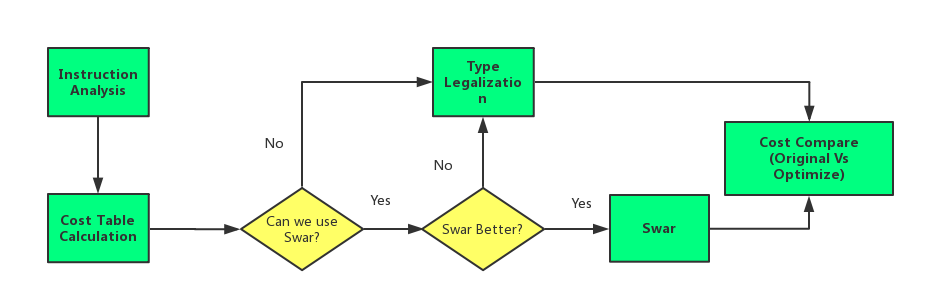

## Three-Level Cost Model 

### Brief description

* Traditional cost model evaluate the **total instruction number**, we regard this as a **second level cost**.
* Since we have multiple options for a certain instruction, there will be many option transformation, we call it **transformation cost**, transformation might introduce many memory operations, which is much "heavier" than register operation cost, we regard transformation cost as **first level cost**.
* The **CPU circle cost** is the **third level cost**, which isn't the total CPU circles needed by all the instructions, since basic instruction can run simultaneously.

These three level cost have the same tendency, if there're more transformations, there might be more instructions, which will lead to more CPU circles when execute these instructions. 

But the tendency is not always identical, considering following cases:
1. Let α and β be two implementations, α has more instructions than β but introduces less transformations, β may be more expensive.
2. Let α and β be two implementations, α has more instructions but those instructions have shorter CPU latency and can be execute simultaneously, β may be more expensive.

This means these three kinds of cost need to be considered seperately. We want fewer instructions, but we also want minimum transformations, meanwhile, the CPU circle cost is also better when small.
But we can only verify the above hypothesis once we finish the Type Legalization & SWAR part and get the three-level cost table.

We can't get the optimal cost implementation as we mentioned at the beginning, but we can get the result such as if there're a lot of instructions which introduce overflow (e.g. there is a large portion of *mul*), which implementation is better than the other.

### Next to do

Register number is another important parameter !

If we only consider the total instruction number, we will always give up the option of SWAR, because SWAR will introduce more instructions, but it definitely save the register.

Now we're facing a problem of how to quatify the register number within the three-level cost model. T_T
