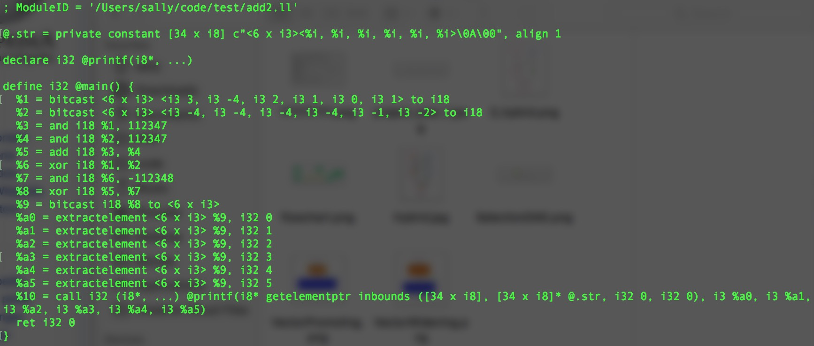
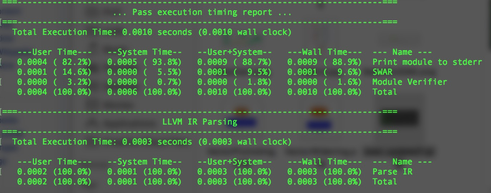

# SWAR

#### Addition Algorithm
```
SWAR add z = x + y

z = ((x &~H) + (y &~H)) ^ ((x ^ y) & H)
```

```llvm
define i32 @main() {
  ; Original code
  %a = add <6 x i3> <i3 3, i3 4, i3 2, i3 1, i3 0, i3 1>, <i3 4, i3 4, i3 4, i3 4, i3 1, i3 2>
  ret i32 0
}
```

```llvm
define i32 @main() {
  ; After optimizatioin
  ; %v1 = <6 x i3> <i3 3, i3 4, i3 2, i3 1, i3 0, i3 1>
  ; %v2 = <6 x i3> <i3 4, i3 4, i3 4, i3 4, i3 1, i3 2>

  %low_v1 = and i18 33443, 112347 ;get low bits for every field
  %low_v2 = and i18 71972, 112347
  ;decimal 112347 = binary 011 011 011 011 011 011
  ;i18 %v1:     < 3   4   2   1   0   1 >
  ;AND: %v1     <011 100 010 001 000 001> & 
  ;     112347  <011 011 011 011 011 011>
  ;i18 %low_v1: <011 000 010 001 000 001>
  ;i18 %low_v2: <000 000 000 000 001 010>
  %low_add = add i18 %low_v1, %low_v2 ; get the result of addition of two vectors' low bits.
  ;i18 %low_add: <011 000 010 001 001 011>
  %overflow = xor i18 33443, 71972
  ;i18 %v1: <011 100 010 001 000 001>
  ;i18 %v2: <100 100 100 100 001 010>
  ;XOR i18: <111 000 110 101 001 011>
  %high_add = and i18 %overflow, 149796
  ;decimal 149796 = binary 100 100 100 100 100 100
  ;AND: %overflow: <111 000 110 101 001 011> &
  ;        149796: <100 100 100 100 100 100>
  ;i18  %high_add: <100 000 100 100 000 000>
  %result = xor i18 %low_add, %high_add
  ;XOR:  %low_add: <011 000 010 001 001 011> or
  ;     %high_add: <100 000 100 100 000 000>
  ;       %result: <111 000 110 101 001 011>
  ;                < 3   4   2   1   0   1 >
  ;                < 4   4   4   4   1   2 >
  ;                < 7   0   6   5   1   3 >
  ret i32 0
}
```

#### Subtraction Algorithm
```
SWAR sub z = x - y;

z = ((x | H) - (y &~H)) ^ ((x ^~y) & H)
```

```llvm
define i32 @main() {
  ; Original code
  %a = sub <6 x i3> <i3 3, i3 4, i3 2, i3 1, i3 0, i3 1>, <i3 4, i3 4, i3 4, i3 4, i3 1, i3 2>
  ret i32 0
}
```

```llvm
define i32 @main() {
  ; After optimizatioin
  ; %v1 = <6 x i3> <i3 4, i3 4, i3 4, i3 4, i3 1, i3 2>
  ; %v2 = <6 x i3> <i3 3, i3 4, i3 2, i3 1, i3 0, i3 1>

  %low_v1 = or i18 71972, 149796 ;get low bits for every field
  ;i18 %v1:     < 4   4   4   4   1   2 >
  ;OR: %v1      <100 100 100 100 001 010> & 
  ;     149796  <100 100 100 100 100 100>
  ;i18 %low_v1: <100 100 100 100 101 110>
  %low_v2 = and i18 33443, 112347
  ;i18 %v2:     < 3   4   2   1   0   1 >
  ;AND: %v2     <011 100 010 001 000 001> & 
  ;     112347  <011 011 011 011 011 011>
  ;i18 %low_v2: <011 000 010 001 000 001>
  %low_sub = sub i18 %low_v1, %low_v2 ; get the result of addition of two vectors' low bits.
  ;i18 %low_sub: <001 100 010 011 101 101>
  %_v2 = xor i18 33443, 262143
  %overflow = xor i18 71972, %_v2
  ;i18 %v1:  <100 100 100 100 001 010>
  ;i18 %_v2: <100 011 101 110 111 110>
  ;XOR i18:  <000 111 001 010 110 100>
  %high_sub = and i18 %overflow, 149796
  ;AND: %overflow: <000 111 001 010 110 100> &
  ;        149796: <100 100 100 100 100 100>
  ;i18  %high_sub: <000 100 000 000 100 100>
  %result = xor i18 %low_sub, %high_sub
  ;XOR:  %low_sub: <001 100 010 011 101 101> or
  ;     %high_sub: <000 100 000 000 100 100>
  ;       %result: <001 000 010 011 001 001>
  ;                < 4   4   4   4   1   2 >
  ;                < 3   4   2   1   0   1 >
  ;                < 1   0   2   3   1   1 >
  ret i32 0
}
```
#### Average Algorithm
```
SWAR average z = (x+y)/2 based on x + y = (x^y) + 2*(x&y)
    z = (x & y) + (((x ^ y) & ~L) >> 1)
```
#### Accomplishment
Original file: test.ll
```llvm
@.str = private constant [34 x i8] c"<6 x i3><%i, %i, %i, %i, %i, %i>\0A\00", align 1
declare i32 @printf(i8*, ...)

define i32 @main() {
  %a = add <6 x i3> <i3 3, i3 4, i3 2, i3 1, i3 0, i3 1>, <i3 4, i3 4, i3 4, i3 4, i3 -1, i3 -2>
  %a0 = extractelement <6 x i3> %a, i32 0
  %a1 = extractelement <6 x i3> %a, i32 1
  %a2 = extractelement <6 x i3> %a, i32 2
  %a3 = extractelement <6 x i3> %a, i32 3
  %a4 = extractelement <6 x i3> %a, i32 4
  %a5 = extractelement <6 x i3> %a, i32 5
  %1 = call i32 (i8*, ...) @printf(i8* getelementptr inbounds ([34 x i8], [34 x i8]* @.str, i32 0, i32 0), i3 %a0, i3 %a1, i3 %a2, i3 %a3, i3 %a4, i3 %a5)
  ret i32 0
}
```
After pass:


Running time:

#### Difficulties
* Bitcast
```llvm
  %b1 = trunc i18 %result to i3
  %shr1 = lshr i18 %result, 3
  %b2 = trunc i18 %shr1 to i3
  %shr2 = lshr i18 %b2, 3
  %b3 = trunc i18 %shr2 to i3
  %shr3 = lshr i18 %b3, 3
  %b4 = trunc i18 %shr3 to i3
  %shr4 = lshr i18 %b4, 3
  %b5 = trunc i18 %shr4 to i3
  %shr5 = lshr i18 %b5, 3
  %b6 = trunc i18 %shr5 to i3

  %c = alloca <6 x i3>
  %c1 = load <6 x i3>, <6 x i3>* %c
  %c2 = insertelement <6 x i3> %c1, i3 %b0, i8 0
  %c3 = insertelement <6 x i3> %c2, i3 %b1, i8 1
  %c4 = insertelement <6 x i3> %c3, i3 %b2, i8 2
  %c5 = insertelement <6 x i3> %c4, i3 %b3, i8 3
  %c6 = insertelement <6 x i3> %c5, i3 %b4, i8 4
  %c7 = insertelement <6 x i3> %c6, i3 %b5, i8 5
```
* Negative numbers - Two-complements'
<6 x i3> <-1, 0, -2, -3, -1, -1>
<6 x i3> <7, 0, 6, 5, 7, 7>

#### Next
* Optimization
* Other Operations
  * Multiplicatioin/Division
  * Bit Reverse
  * Log2 of an Integer
  * Most Significant 1 Bit
  * Popcount
